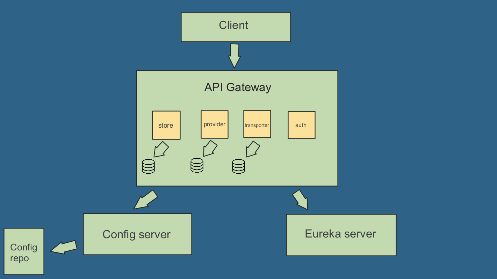

# Flower Shop

## Flower Shop system, developed during studies on software architecture based on microservices.

---

Content table
=================
* [About](#about)
* [Content table](#content-table)
* [Project Status](#project-status)
* [Architecture model](#architecture-model)
* [Features](#features)
* [Techs](#techs)
* [Author](#author)

---
### Project Status
<h4 align="center"> 
	🚧  Project under development...  🚧
</h4>

---

### Architecture model

---

### Features
- [x] Place a purchase order.
- [x] Get order information based on id.
- [x] Get available provider information based on user-reported state.
- [x] Get list of available products based on user-reported state.
- [x] Scheduling of delivery of the order.

---
### Techs
The following technologies were used in the construction of the project:

- [Eureka](https://spring.io/guides/gs/service-registration-and-discovery/) -  Service Registration and Discovery 
- [Spring Cloud Config](https://cloud.spring.io/spring-cloud-config/reference/html/) - Provides server-side and client-side support for externalized configuration in a distributed system.
- [Ribbon](https://cloud.spring.io/spring-cloud-netflix/multi/multi_spring-cloud-ribbon.html) - Client Side Load Balancer
- [Feign](https://docs.spring.io/spring-cloud-openfeign/docs/current/reference/html/) - Web service client
- [Hystrix](https://github.com/Netflix/Hystrix) - Helps to control the interaction between services by providing fault tolerance and latency tolerance.
- [Zuul](https://github.com/Netflix/zuul) - API gateway

---
### Author
<a href="https://github.com/eduardowanderleydev">
 
  
 <b>Eduardo Wanderley</b></a>

Contact : 👋🏽

